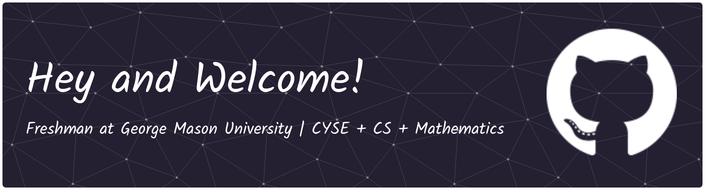

<!---
- 👋 Hi, I’m @selsayed25
- 👀 I’m interested in Science (mostly Biology and Chemistry), Tech, Mathematics, and programming (Python, Java, HTML, CSS, R, and SQL)
- 🌱 I’m currently learning how to speak Python, Java, and HTML. 
- 📫 How to reach me: Facebook and Instagram: @samielsayedtj
--->

# Sami's Learning Environment

Welcome! My name is Sami Elsayed and I'm currently a Freshman at [George Mason University](https://www.gmu.edu) studying Cyber Security Engineering, with the likelihood of double majoring in computer science and minoring in mathematics. I graduated from Thomas Jefferson High School for Science and Technology in 2025, where I was actively involved in various tech-related projects and classes, and was the Lead Sysadmin at my school's computer systems lab ([@tjcsl](https://github.com/tjcsl)). I love programming and building things, some of my favorite projects that I'm currently making or have made:

- [The Techbook](https://github.com/selsayed25/techbook): Home to the world's information on every aspect of Tech. It's a collection of the best explanation on things in once nice place!
- [Snakepy](https://github.com/selsayed25/snakepy) - A Snake game using Pygame
- [A drawing app using Python](https://github.com/selsayed25/python-drawing-app)
- [My very own website!](https://github.com/selsayed25/website)
- [Codects](https://tcedco.github.io/website): A series where I develop projects and posts about things I find interesting in STEM. Interesting things ranging from blockchain, to teaching derivatives, to estimating pi using the Monte Carlo method and more.

...and so much more!

I'm also the Founder of Heliothon, a hopefull startup that aims to revolutionize AI hardware through research and developing a new type of AI chip that would be more efficient, cheaper, and faster than current AI chips. You can find out more about Heliothon on [our website](https://heliothon.github.io/).

## Inquires

You can message me via Facebook Messenger or Instagram, or email me at [elsayedcyber@gmail.com](mailto:elsayedcyber@gmail.com)

If you want to collaborate on a project, or have any questions, feel free to reach out! I'm always open to new ideas and opportunities.

My Resume is available as well for your convenience [here](./static/docs/resume.pdf).

## My Github Stats

## Profile Views count

<!---
selsayed25/selsayed25 is a ✨ special ✨ repository because its `README.md` (this file) appears on your GitHub profile.
You can click the Preview link to take a look at your changes.
--->
