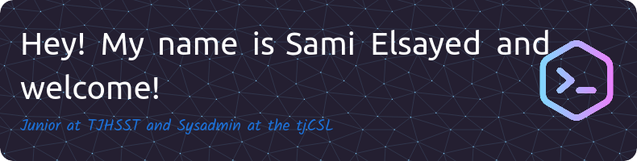

<!---
- 👋 Hi, I’m @selsayed25
- 👀 I’m interested in Science (mostly Biology and Chemistry), Tech, Mathematics, and programming (Python, Java, HTML, CSS, R, and SQL)
- 🌱 I’m currently learning how to speak Python, Java, and HTML. 
- 📫 How to reach me: Facebook and Instagram: @samielsayedtj
--->

# Sami's Learning Environment

Welcome! My name is Sami Elsayed and I'm currently a Junior at [Thomas Jefferson High School for Science and Technology](https://tjhsst.fcps.edu). I am a current Sysadmin at my school's computer systems lab ([@tjcsl](https://github.com/tjcsl)) in which I work on maintaining the school's main infrastructure. I love programming and building things, some of my favorite projects that I'm currently making or have made:

- [The Techbook (currently private)](https://github.com/selsayed25/techbook): Home to the world's information on every aspect of Tech. It's a collection of the best explanation on things in once nice place!
- [Snakepy](https://github.com/selsayed25/snakepy) - A Snake game using Pygame
- [A drawing app using Python](https://github.com/selsayed25/python-drawing-app)
- [My very own website!](https://github.com/selsayed25/mywebsite)

...and so much more!

I'm also the Founder of Cardinal ([@cardinaldevorg](https://github.com/cardinaldevorg)), a organization dedicated to developing and creating the next generation of coders and developers through projects that would help the massive community in the Washington D.C Metro area. We also have an initiative to teach underrepresented and low-income kids and adults programming and the tech world through projects and events!

I'm also currently a volunteer and a contributor at Mozilla ([@mozilla](https://github.com/mozilla)), where I'm trying to learn the basics and the key ideas of what life is as a software engineer and as a data scientist.

## My Task List

Currently for the summer, I have a few initatives before I go into the 2023-2024 school year:

- [ ] Make Cardinal Public and Send Positions Forms
- [ ] Pre-study Physics
- [ ] Push the Techbook to Alpha stage
- [ ] Plan out a schedule for the school year (trying to promote exercising, coding, and learning all in one schedule)
- [ ] Finalize a list of ideas for a senior research project

## Inquires

You can message me via Facebook Messenger or Instagram, or email me at [techfluente@gmail.com](mailto:techfluente@gmail.com)

## My Github Stats

## Profile Views count

<!---
selsayed25/selsayed25 is a ✨ special ✨ repository because its `README.md` (this file) appears on your GitHub profile.
You can click the Preview link to take a look at your changes.
--->
